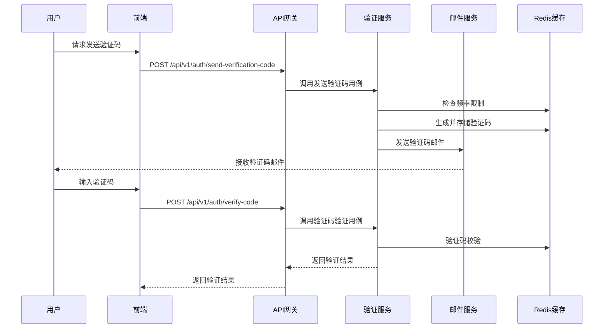

# 邮箱验证码功能设计文档

## 1. 功能概述

邮箱验证码功能为用户注册、密码重置、邮箱修改等关键操作提供安全验证机制。通过向用户邮箱发送验证码，确保操作的真实性和安全性。

## 2. 业务场景

### 2.1 支持的验证场景

- **用户注册** (`registration`): 新用户注册时验证邮箱有效性
- **密码重置** (`password_reset`): 忘记密码时验证用户身份
- **邮箱修改** (`email_change`): 用户修改邮箱时验证新邮箱
- **敏感操作** (`sensitive_operation`): 其他需要邮箱验证的敏感操作

### 2.2 业务流程



## 3. 技术架构

### 3.1 DDD架构设计

```
user_management/
├── domain/
│   ├── entities/
│   │   └── verification_code.py          # 验证码实体
│   ├── value_objects/
│   │   ├── email_address.py              # 邮箱地址值对象
│   │   └── verification_purpose.py       # 验证目的值对象
│   ├── services/
│   │   └── email_verification_service.py # 邮箱验证领域服务
│   └── repositories/
│       └── verification_code_repository.py # 验证码仓储接口
├── application/
│   ├── use_cases/
│   │   ├── send_verification_code_use_case.py # 发送验证码用例
│   │   └── verify_code_use_case.py           # 验证验证码用例
│   └── dto/
│       ├── send_verification_code_dto.py     # 发送验证码DTO
│       └── verify_code_dto.py                # 验证验证码DTO
├── infrastructure/
│   ├── repositories/
│   │   └── redis_verification_code_repository.py # Redis验证码仓储实现
│   ├── external_services/
│   │   ├── email_service.py                      # 邮件服务
│   │   └── email_template_service.py             # 邮件模板服务
│   └── models/
│       └── verification_code_model.py            # 验证码数据模型
└── presentation/
    ├── api/
    │   └── verification_routes.py                # 验证码API路由
    └── schemas/
        ├── send_verification_code_schema.py      # 发送验证码请求模式
        └── verify_code_schema.py                 # 验证验证码请求模式
```

### 3.2 核心组件

#### 3.2.1 领域层 (Domain)

**VerificationCode 实体**
```python
class VerificationCode:
    def __init__(self, email: EmailAddress, code: str, purpose: VerificationPurpose, 
                 expires_at: datetime, attempts: int = 0):
        self.email = email
        self.code = code
        self.purpose = purpose
        self.expires_at = expires_at
        self.attempts = attempts
        self.created_at = datetime.utcnow()
    
    def is_expired(self) -> bool:
        return datetime.utcnow() > self.expires_at
    
    def is_max_attempts_reached(self, max_attempts: int = 3) -> bool:
        return self.attempts >= max_attempts
    
    def increment_attempts(self) -> None:
        self.attempts += 1
```

**EmailVerificationService 领域服务**
```python
class EmailVerificationService:
    def generate_code(self, length: int = 6) -> str:
        """生成指定长度的数字验证码"""
        return ''.join(random.choices(string.digits, k=length))
    
    def validate_code_format(self, code: str) -> bool:
        """验证验证码格式"""
        return code.isdigit() and len(code) == 6
    
    def calculate_expiry_time(self, minutes: int = 5) -> datetime:
        """计算验证码过期时间"""
        return datetime.utcnow() + timedelta(minutes=minutes)
```

#### 3.2.2 应用层 (Application)

**SendVerificationCodeUseCase**
```python
class SendVerificationCodeUseCase:
    def __init__(self, 
                 verification_repo: VerificationCodeRepository,
                 email_service: EmailService,
                 rate_limiter: RateLimiter):
        self.verification_repo = verification_repo
        self.email_service = email_service
        self.rate_limiter = rate_limiter
    
    async def execute(self, request: SendVerificationCodeRequest) -> SendVerificationCodeResponse:
        # 1. 检查频率限制
        await self.rate_limiter.check_rate_limit(request.email, request.purpose)
        
        # 2. 生成验证码
        verification_service = EmailVerificationService()
        code = verification_service.generate_code()
        expires_at = verification_service.calculate_expiry_time()
        
        # 3. 创建验证码实体
        verification_code = VerificationCode(
            email=EmailAddress(request.email),
            code=code,
            purpose=VerificationPurpose(request.purpose),
            expires_at=expires_at
        )
        
        # 4. 存储验证码
        await self.verification_repo.save(verification_code)
        
        # 5. 发送邮件
        await self.email_service.send_verification_email(
            email=request.email,
            code=code,
            purpose=request.purpose
        )
        
        return SendVerificationCodeResponse(success=True)
```

#### 3.2.3 基础设施层 (Infrastructure)

**RedisVerificationCodeRepository**
```python
class RedisVerificationCodeRepository(VerificationCodeRepository):
    def __init__(self, redis_client: Redis):
        self.redis = redis_client
    
    async def save(self, verification_code: VerificationCode) -> None:
        key = self._build_key(verification_code.email.value, verification_code.purpose.value)
        data = {
            'code': verification_code.code,
            'attempts': verification_code.attempts,
            'created_at': verification_code.created_at.isoformat()
        }
        ttl = int((verification_code.expires_at - datetime.utcnow()).total_seconds())
        await self.redis.setex(key, ttl, json.dumps(data))
    
    async def find_by_email_and_purpose(self, email: str, purpose: str) -> Optional[VerificationCode]:
        key = self._build_key(email, purpose)
        data = await self.redis.get(key)
        if not data:
            return None
        
        parsed_data = json.loads(data)
        ttl = await self.redis.ttl(key)
        expires_at = datetime.utcnow() + timedelta(seconds=ttl)
        
        return VerificationCode(
            email=EmailAddress(email),
            code=parsed_data['code'],
            purpose=VerificationPurpose(purpose),
            expires_at=expires_at,
            attempts=parsed_data['attempts']
        )
    
    def _build_key(self, email: str, purpose: str) -> str:
        return f"verification_code:{email}:{purpose}"
```

**EmailService**
```python
class EmailService:
    def __init__(self, smtp_config: SMTPConfig, template_service: EmailTemplateService):
        self.smtp_config = smtp_config
        self.template_service = template_service
    
    async def send_verification_email(self, email: str, code: str, purpose: str) -> None:
        # 1. 生成邮件内容
        subject, html_content = await self.template_service.render_verification_email(
            code=code, purpose=purpose
        )
        
        # 2. 发送邮件
        msg = MIMEMultipart('alternative')
        msg['Subject'] = subject
        msg['From'] = self.smtp_config.username
        msg['To'] = email
        
        html_part = MIMEText(html_content, 'html')
        msg.attach(html_part)
        
        with smtplib.SMTP(self.smtp_config.server, self.smtp_config.port) as server:
            server.starttls()
            server.login(self.smtp_config.username, self.smtp_config.password)
            server.send_message(msg)
```

## 4. API接口设计

### 4.1 发送验证码接口

**请求**
```http
POST /api/v1/auth/send-verification-code
Content-Type: application/json

{
    "email": "user@example.com",
    "purpose": "registration"
}
```

**响应**
```json
{
    "success": true,
    "message": "验证码已发送到您的邮箱",
    "data": {
        "expires_in": 300
    },
    "request_id": "req_123456789"
}
```

**错误响应**
```json
{
    "success": false,
    "message": "发送验证码失败",
    "errors": [
        {
            "code": "RATE_LIMIT_EXCEEDED",
            "message": "发送频率过快，请稍后再试",
            "details": {
                "retry_after": 60
            }
        }
    ],
    "request_id": "req_123456789"
}
```

### 4.2 验证验证码接口

**请求**
```http
POST /api/v1/auth/verify-code
Content-Type: application/json

{
    "email": "user@example.com",
    "code": "123456",
    "purpose": "registration"
}
```

**响应**
```json
{
    "success": true,
    "message": "验证码验证成功",
    "data": {
        "verified": true,
        "verification_token": "eyJhbGciOiJIUzI1NiIsInR5cCI6IkpXVCJ9..."
    },
    "request_id": "req_123456789"
}
```

## 5. 数据存储设计

### 5.1 Redis存储结构

**Key格式**: `verification_code:{email}:{purpose}`

**Value结构**:
```json
{
    "code": "123456",
    "attempts": 0,
    "created_at": "2024-01-15T10:30:00Z"
}
```

**TTL**: 300秒 (5分钟)

### 5.2 频率限制存储

**Key格式**: `rate_limit:email:{email}` 和 `rate_limit:ip:{ip}`

**Value**: 发送次数计数器

**TTL**: 3600秒 (1小时)

## 6. 安全措施

### 6.1 频率限制

- **邮箱级别**: 同一邮箱1分钟内只能发送1次验证码
- **IP级别**: 同一IP每小时最多发送10次验证码
- **全局级别**: 系统每分钟最多发送100次验证码

### 6.2 验证码安全

- **长度**: 6位数字
- **有效期**: 5分钟
- **尝试次数**: 最多3次，超过后需重新发送
- **一次性使用**: 验证成功后立即失效

### 6.3 防护机制

- **输入验证**: 严格验证邮箱格式和验证码格式
- **日志记录**: 记录所有发送和验证行为
- **异常监控**: 监控异常发送和验证行为
- **黑名单机制**: 支持邮箱和IP黑名单

## 7. 配置管理

### 7.1 环境变量配置

```bash
# SMTP邮件服务配置
SMTP_SERVER=smtp.gmail.com
SMTP_PORT=587
SMTP_USERNAME=your-email@gmail.com
SMTP_PASSWORD=your-app-password
SMTP_USE_TLS=true

# 验证码配置
VERIFICATION_CODE_LENGTH=6
VERIFICATION_CODE_EXPIRE_MINUTES=5
VERIFICATION_CODE_MAX_ATTEMPTS=3

# 频率限制配置
RATE_LIMIT_EMAIL_INTERVAL_SECONDS=60
RATE_LIMIT_IP_MAX_PER_HOUR=10
RATE_LIMIT_GLOBAL_MAX_PER_MINUTE=100

# Redis配置
REDIS_URL=redis://localhost:6379/0
```

### 7.2 应用配置

```python
# config/settings.py
class EmailVerificationSettings:
    # 验证码配置
    CODE_LENGTH: int = 6
    CODE_EXPIRE_MINUTES: int = 5
    CODE_MAX_ATTEMPTS: int = 3
    
    # 频率限制配置
    RATE_LIMIT_EMAIL_INTERVAL: int = 60  # 秒
    RATE_LIMIT_IP_MAX_PER_HOUR: int = 10
    RATE_LIMIT_GLOBAL_MAX_PER_MINUTE: int = 100
    
    # SMTP配置
    SMTP_SERVER: str
    SMTP_PORT: int = 587
    SMTP_USERNAME: str
    SMTP_PASSWORD: str
    SMTP_USE_TLS: bool = True
    
    # 邮件模板配置
    TEMPLATE_DIR: str = "templates/email"
    DEFAULT_FROM_NAME: str = "Workflow Platform"
```

## 8. 邮件模板设计

### 8.1 验证码邮件模板

```html
<!-- templates/email/verification_code.html -->
<!DOCTYPE html>
<html>
<head>
    <meta charset="UTF-8">
    <title>邮箱验证码</title>
    <style>
        .container { max-width: 600px; margin: 0 auto; font-family: Arial, sans-serif; }
        .header { background-color: #f8f9fa; padding: 20px; text-align: center; }
        .content { padding: 30px; }
        .code { font-size: 32px; font-weight: bold; color: #007bff; text-align: center; 
                letter-spacing: 5px; margin: 20px 0; }
        .footer { background-color: #f8f9fa; padding: 20px; font-size: 12px; color: #666; }
    </style>
</head>
<body>
    <div class="container">
        <div class="header">
            <h1>Workflow Platform</h1>
        </div>
        <div class="content">
            <h2>邮箱验证码</h2>
            <p>您好，</p>
            <p>您正在进行{{ purpose_text }}操作，请使用以下验证码完成验证：</p>
            <div class="code">{{ code }}</div>
            <p>验证码有效期为5分钟，请及时使用。如果这不是您的操作，请忽略此邮件。</p>
        </div>
        <div class="footer">
            <p>此邮件由系统自动发送，请勿回复。</p>
            <p>© 2024 Workflow Platform. All rights reserved.</p>
        </div>
    </div>
</body>
</html>
```

### 8.2 模板变量映射

```python
PURPOSE_TEXT_MAPPING = {
    'registration': '用户注册',
    'password_reset': '密码重置',
    'email_change': '邮箱修改',
    'sensitive_operation': '敏感操作验证'
}
```

## 9. 错误处理

### 9.1 错误码定义

```python
class VerificationErrorCodes:
    # 发送验证码错误
    RATE_LIMIT_EXCEEDED = "RATE_LIMIT_EXCEEDED"
    EMAIL_SEND_FAILED = "EMAIL_SEND_FAILED"
    INVALID_EMAIL_FORMAT = "INVALID_EMAIL_FORMAT"
    
    # 验证验证码错误
    CODE_NOT_FOUND = "CODE_NOT_FOUND"
    CODE_EXPIRED = "CODE_EXPIRED"
    CODE_INVALID = "CODE_INVALID"
    MAX_ATTEMPTS_EXCEEDED = "MAX_ATTEMPTS_EXCEEDED"
    
    # 系统错误
    REDIS_CONNECTION_ERROR = "REDIS_CONNECTION_ERROR"
    SMTP_CONNECTION_ERROR = "SMTP_CONNECTION_ERROR"
```

### 9.2 异常处理策略

```python
class VerificationCodeException(Exception):
    def __init__(self, code: str, message: str, details: dict = None):
        self.code = code
        self.message = message
        self.details = details or {}
        super().__init__(message)

class RateLimitExceededException(VerificationCodeException):
    def __init__(self, retry_after: int):
        super().__init__(
            code=VerificationErrorCodes.RATE_LIMIT_EXCEEDED,
            message="发送频率过快，请稍后再试",
            details={"retry_after": retry_after}
        )
```

## 10. 监控和日志

### 10.1 关键指标监控

- **发送成功率**: 验证码邮件发送成功率
- **验证成功率**: 验证码验证成功率
- **平均响应时间**: API接口响应时间
- **错误率**: 各类错误的发生率
- **频率限制触发率**: 频率限制的触发频率

### 10.2 日志记录

```python
# 发送验证码日志
logger.info("Verification code sent", extra={
    "email": email,
    "purpose": purpose,
    "code_length": len(code),
    "expires_at": expires_at.isoformat(),
    "request_id": request_id
})

# 验证验证码日志
logger.info("Verification code verified", extra={
    "email": email,
    "purpose": purpose,
    "success": success,
    "attempts": attempts,
    "request_id": request_id
})

# 错误日志
logger.error("Verification code send failed", extra={
    "email": email,
    "purpose": purpose,
    "error_code": error_code,
    "error_message": error_message,
    "request_id": request_id
})
```

## 11. 测试策略

### 11.1 单元测试

- **领域服务测试**: 验证码生成、格式验证等逻辑
- **用例测试**: 发送和验证验证码的业务逻辑
- **仓储测试**: Redis存储和查询逻辑
- **邮件服务测试**: 邮件发送逻辑（使用Mock）

### 11.2 集成测试

- **API端到端测试**: 完整的发送和验证流程
- **Redis集成测试**: 实际Redis环境下的存储测试
- **邮件集成测试**: 实际邮件服务的发送测试

### 11.3 性能测试

- **并发发送测试**: 高并发场景下的验证码发送
- **频率限制测试**: 验证频率限制的有效性
- **Redis性能测试**: 大量验证码存储的性能表现

## 12. 部署和运维

### 12.1 依赖服务

- **Redis**: 用于存储验证码和频率限制数据
- **SMTP服务**: 用于发送邮件（Gmail、QQ邮箱等）
- **监控系统**: 用于监控服务状态和性能指标

### 12.2 部署检查清单

- [ ] Redis连接配置正确
- [ ] SMTP服务配置正确
- [ ] 邮件模板文件存在
- [ ] 环境变量配置完整
- [ ] 频率限制参数合理
- [ ] 监控和日志配置正确

### 12.3 运维监控

- **健康检查**: 定期检查Redis和SMTP服务连接
- **性能监控**: 监控API响应时间和成功率
- **错误告警**: 关键错误的实时告警
- **容量规划**: 根据使用量调整Redis容量和邮件发送限额

## 13. 未来扩展

### 13.1 多渠道支持

- **短信验证码**: 支持手机短信验证码
- **语音验证码**: 支持语音播报验证码
- **推送通知**: 支持App推送验证码

### 13.2 高级功能

- **图形验证码**: 结合图形验证码防止机器人
- **生物识别**: 支持指纹、面部识别等
- **风险评估**: 基于用户行为的风险评估

### 13.3 性能优化

- **邮件队列**: 使用消息队列异步发送邮件
- **缓存优化**: 优化Redis使用和缓存策略
- **负载均衡**: 支持多实例部署和负载均衡

---

**文档版本**: v1.0  
**创建日期**: 2024-01-15  
**最后更新**: 2024-01-15  
**维护人员**: 开发团队